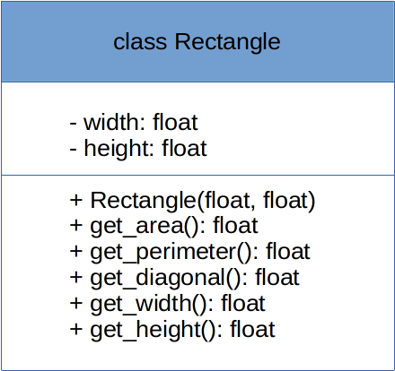
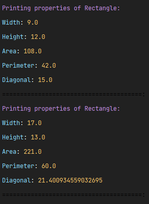

# introduction_to_classes Python OOP Concepts
## TV Party Task

It's time to make a TV party! You invited your friends over on a Saturday night to watch some movies on Netflix. The popcorn is ready, so let's set the TV to work!

The TV **class** is already created for you and will have regular TV operations such as Turn On, Turn Off, Volume Up, Volume Down, Channel Up, Channel Down, Set Channel and Set Volume.

These operations are defined in the TV **class**, and therefore, are common operations to any TV. But knowing what a TV does doesn't mean you have a TV, and that's why you need to have an **instance object** of the TV class.

### Overview of tv.py:
- Initialize the channel variable and set it to 1;
- Initialize the volume_level variable and set it to 1;
- Set the turned_on variable to False so that the TV is in the default off position;
- turn_on() method should turn the TV on;
- turn_off() method should turn the TV off;
- channel_up() should increment the channel by 1. Note that the TV must be on;
- channel_down() should decrement the channel by 1. Note that the TV must be on;
- set_channel() method to set the TV to a specific channel. Note that the TV must be on;
- volume_up() should increment the volume by 1. Note that the TV must be on;
- volume_down() should decrement the volume by 1. Note that the TV must be on;
- The channel's range should be between 1 and 100. The methods channel_up(), channel_down() and set_channel() should take this range into account;
- The volume's range should be between 1 and 10. The methods volume_up() and volume_down() should take this range into account.

### Overview of tv_party.py:
- Create an instance object of the TV class;
- Part 1:
  - Turn the TV on;
  - Set the channel to 3;
  - Set the volume to 7;
- Set the TV off for food break;
- Part 2:
    - Turn the TV on;
    - Set the channel to 95;
    - Set the volume to 5;

## Rectangle Class Task

In this exercise, we want to create a definitions of a rectangle (**class**) and, afterwards, create
a few instances (**objects**) out of it.

We'll start by taking a look at a class definition of a Rectangle:

With this image in mind:

1. The first area represents what the class name should be: **Rectangle**.
2. The second area represents the attributes (**fields**) the Rectangle class should have: **width**
   and **height**, and both should be of type **float**.
3. Last but not least, the third area contains the behavior (**methods**) of the Rectangle class.

Let's go through each one of those:

### - width: float and height: float

**Width** and **height** are the two properties that define a rectangle: **every** rectangle has to
have a width and height defined, and then you can calculate properties like **area**, **perimeter**
or
**diagonal** out of these properties. In our class, both properties should be of type **float**.

### + Rectangle(float, float)

This method, represented this way, represents the **class's constructor**. The class will have a
constructor that receives both the width and height and set the instance's properties with
the received values.

### + get_area(): float

To find the area of a rectangle, just multiply the width times the height:
`Area = W x H`. Since we're using floats on the equation, the **get_area()** should return the
result as a float as well.

### + get_perimeter(): float

The perimeter of a rectangle is defined as the sum of all sides. Since it has equal values on both
left-right sides and top-bottom sides, the perimeter can be defined as:
`Perimeter = 2W + 2H`.

### + get_diagonal(): float

To find the length of the diagonal of a rectangle, use the Pythagorean Theorem:
`Diagonal = √ (W² + H²)`.

In Python, to achieve the **power** of a number, you can use the ** operator like this: `base ** exponent` or use the built-in pow function like this: pow(base, exponent).
If you want to ensure that both base and exponent are converted to floats, use `math.pow`. [Official documentation](https://docs.python.org/3/library/math.html#math.pow)

To achieve the **square root**, you can use `math.sqrt(value)`
. [Official documentation](https://docs.python.org/3/library/math.html#math.sqrt)

### + get_width(): float

This method should simply return the **width** of our rectangle.

### + get_height(): float

This method should simply return the **height** of our rectangle.

# Rectangle Objects

Now that we have our **Rectangle class** defined, we can move on to create **object instances** out
of it!

We'll be doing it in the **app.py** file. It contains our **main method**.

Create a few different **instances objects** of the Rectangle class. Use the Rectangle constructor
to initialize the instances, passing different widths and heights. Call the method
`print_rectangle_properties(rectangle)` for each rectangle object you created on the main method.

Execute the project by running python on the **app.py** file.

---
Run the program! You should be getting outputs like this:

Keep in mind you can use your own values for width and height.

If you want to make sure your methods are returning the correct values, you can use any Rectangle
Calculator
[like this one](https://www.calculatorsoup.com/calculators/geometry-plane/rectangle.php), and make
sure your program outputs are correct.

## Extra Task

Do a research about `type annotation` in Python and modify your solution to include `type annotations`.

